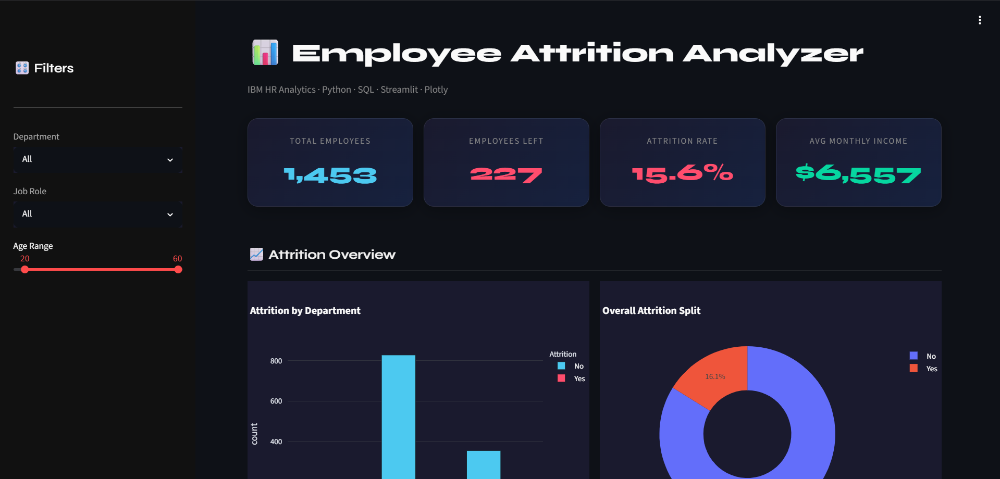
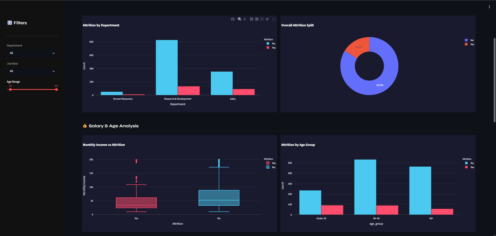
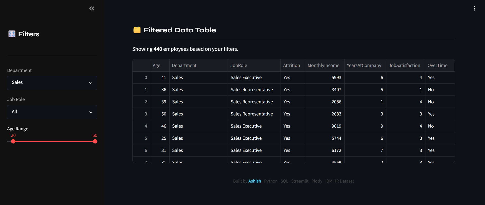

# 📊 Employee Attrition Analyzer

> An interactive data analytics dashboard that identifies **why employees leave** — built with Python, SQL, Streamlit & Plotly.

🔗 **[Live Demo](https://employee-attrition-analyzer.onrender.com/)** · 📁 **[View Code](https://github.com/Ashish10-AI/employee-attrition-analyzer/blob/main/app.py)**



---

## 🧩 The Problem

Companies lose millions every year due to employee attrition — but most HR teams still rely on messy Excel files with no visual clarity.

- No live view of who is leaving and why
- No way to filter by department, role, or age
- Decisions are delayed because insights are buried in raw data

## ✅ The Solution

An interactive dashboard that gives HR managers **instant clarity** on attrition patterns — with real-time filters and auto-generated insights.

> Open the link → See everything in 10 seconds. No Excel. No manual reports.

---

## 📸 Screenshots

### Full Dashboard


### Charts & Visualizations


### Interactive Filters


---

## 🔧 Tech Stack

| Tool | Purpose |
|------|---------|
| Python | Core logic & data processing |
| SQL (SQLite) | Data querying & aggregation |
| Pandas | Data manipulation & analysis |
| Streamlit | Interactive web dashboard UI |
| Plotly Express | Charts & visualizations |
| IBM HR Dataset | 1,470 real employee records |

---

## 📊 Dashboard Features

- ✅ **4 KPI Cards** — Total Employees, Employees Left, Attrition Rate, Avg Salary
- ✅ **Attrition by Department** — Grouped bar chart
- ✅ **Overall Attrition Split** — Donut pie chart
- ✅ **Salary vs Attrition** — Box plot comparing income levels
- ✅ **Attrition by Age Group** — Under 30 / 30–40 / 40+
- ✅ **Attrition by Job Role** — Horizontal bar chart
- ✅ **Sidebar Filters** — Filter by Department, Job Role, Age Range
- ✅ **Auto-Generated Key Insights** — Data-driven conclusions
- ✅ **Raw Data Table** — Filterable employee records
- ✅ **Dark Theme** — Professional UI design

---

## 🔍 Key Insights Found

- 📌 **Sales department** has the highest attrition rate across all departments
- 📌 Employees who left earned significantly **less per month** than those who stayed
- 📌 **Employees under 30** have the highest attrition rate of all age groups

---

## ▶️ Run Locally

```bash
# 1. Clone the repo
git clone https://github.com/YOUR_USERNAME/employee-attrition-analyzer.git
cd employee-attrition-analyzer

# 2. Install dependencies
pip install -r requirements.txt

# 3. Add dataset (download from Kaggle link below)
# Place hr_data.csv inside the data/ folder

# 4. Run the app
streamlit run app.py
```

### Dataset
Download from Kaggle → [IBM HR Analytics Attrition Dataset](https://www.kaggle.com/datasets/pavansubhasht/ibm-hr-analytics-attrition-dataset)
Rename to `hr_data.csv` → place inside `data/` folder

---

## 📁 Project Structure

```
employee-attrition-analyzer/
├── app.py                  ← Main Streamlit dashboard
├── requirements.txt        ← Python dependencies
├── data/
│   └── hr_data.csv         ← IBM HR dataset (1,470 records)
├── screenshot1.png         ← Full dashboard preview
├── screenshot2.png         ← Charts section
├── screenshot3.png         ← Filtered view
└── README.md
```

---

## 📦 Requirements

```
streamlit
pandas
plotly
```

---

## 👨‍💻 Built By

**Ashish** — Freelance Creative Technologist
[🌐 Portfolio](https://my-portfolio-neon-psi-88.vercel.app/) · [💼 LinkedIn](https://www.linkedin.com/in/ashish-yadav-a294212b2/) · [🐙 GitHub](https://github.com/Ashish10-AI)

---

*Built with Python · SQL · Streamlit · Plotly · IBM HR Dataset*
